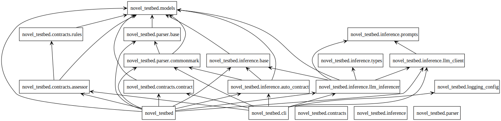

# Package Diagram



This package layout follows a conventional layered architecture. Each package has a narrow, well-defined responsibility, which makes the system easier to debug, extend, and reason about.

You can think of the system as having three vertical layers:

1. Structural layer  
2. Semantic layer  
3. Evaluation layer  

With a thin orchestration layer on top.

Nothing in the system is doing more than one of these jobs.


1. `parser`

The parser package is responsible only for structural analysis.

Its job is to:
- Read raw text
- Identify chapters
- Identify module boundaries
- Assign module types
- Extract text anchors

It does not interpret meaning.  
It does not infer reader response.  
It does not participate in narrative evaluation.

If something is wrong with:
- module boundaries
- missing chapters
- misclassified scenes vs exposition  

the bug is here.

This package should remain deterministic and rule-based. Any semantic logic added here would be architectural contamination.


2. `models`

This is the domain model of the system.

It defines:
- what a Novel is
- what a Module is
- what a ReaderState is
- what a ModuleContract is

There is no logic here beyond data structure behavior.

If a type is missing a field, a relationship is wrong, or serialization fails, this is the place to fix it.  
Nothing in this package should depend on OpenAI, parsing rules, or assessment logic.

This package is the schema of narrative reality.


3. `contracts`

This package converts structure into obligation.

It has three responsibilities:

- `contract.py`  
  Builds and loads contracts. It turns Modules into ModuleContracts and handles YAML serialization.

- `rules.py`  
  Defines atomic narrative validation rules. Each rule expresses one failure condition.

- `assessor.py`  
  Applies rules to contracts and aggregates findings into reports.

If:
- expected changes aren’t recognized
- state transitions are mis-evaluated
- severity levels are wrong  

the bug is here.

This is the heart of narrative validation.


4. `inference`

This package is the semantic front-end.

Its job is to populate contracts automatically by interpreting the novel.

It contains:
- abstract inferencer interfaces
- LLM-backed implementations
- client adapters

Nothing in the system depends on inference being present.  
It is optional and replaceable.

If:
- inferred states look wrong
- prompts misbehave
- model responses break parsing  

the problem is here.

Inference should never leak into parsing, contracts, or rules. It only fills in contracts.


5. `logging_config`

This centralizes logging behavior.

All modules should use `logging.getLogger(__name__)` and rely on this package to configure output.

If logs are missing, duplicated, or formatted incorrectly, this is where to look.


6. `cli`

The CLI is orchestration only.

Its responsibilities:
- Parse arguments
- Call the correct pipeline:
  - parse
  - infer
  - assess
- Read and write files
- Enforce presence of secrets (API keys)

The CLI must not:
- contain business logic
- implement inference
- interpret rules

If commands mis-route, arguments break, or workflows fail to chain correctly, the issue is here.


7. Overall data flow

The system always flows in one direction:

```
Text → Structure → Contract → (Optional Inference) → Assessment → Report
```

No package should violate that ordering.

If a module starts depending on something “above” it in the pipeline, that is a design error.


8. Debugging guidance

When something fails:

| Symptom | Check |
|------|------|
| Modules missing or misaligned | `parser` |
| YAML malformed or missing fields | `contracts.contract` |
| States not compared correctly | `contracts.rules` |
| Wrong PASS/WARN/FAIL | `contracts.assessor` |
| Inference behaving oddly | `inference` |
| Commands not wiring | `cli` |
| Logs missing or noisy | `logging_config` |


9. Development guidance

When adding features:

- New input formats → extend `parser`
- New reader-state dimensions → extend `models.ReaderState`
- New narrative validations → add rules in `contracts.rules`
- New semantic engines → add implementations in `inference`
- New workflows → wire in `cli`

Do not mix these responsibilities.

The architecture works because every package is boring, predictable, and isolated.  
That is what makes the whole system maintainable.