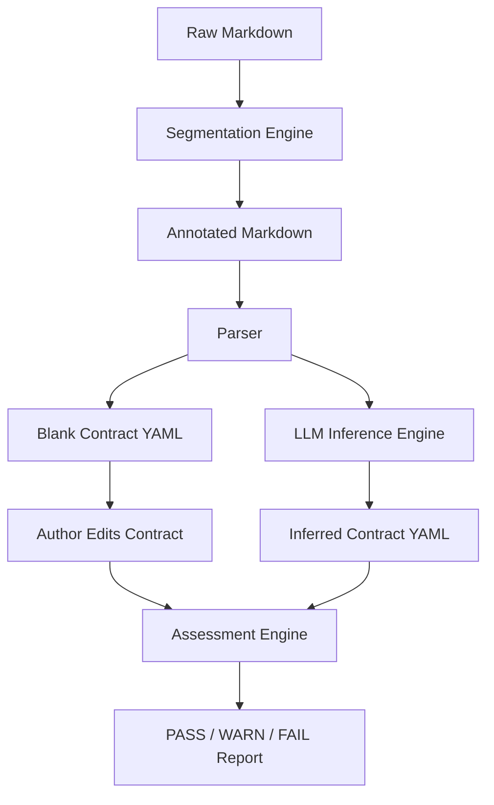

# Novel Testbed

Novel Testbed is a test harness that treats a novel as an executable system.

It assumes a simple premise:  
fiction is not decoration. It is transformation.

Every scene, every block of exposition, every transition is supposed to *do*
something to the reader. Shift power. Increase pressure. Alter belief. Change
genre gravity. Disturb safety. Create threat. Create attachment.

If a module does not change reader state, it is inert.  
If it is inert, it is structural noise.

This system exists to make that visible.

This documentation covers:

- How raw prose is segmented into structural modules
- How annotated Markdown is parsed into executable structure
- How reader state is modeled
- How narrative contracts are declared
- How contracts can be inferred automatically using an LLM
- How module-by-module assessment works
- How failures are reported and interpreted

The system does not care if prose is beautiful.  
It cares if it *changes state*.


## Code

You can find the code in the  
[GitHub repository](https://github.com/mattbriggs/novel_testbed_app).


## Conceptual Pipeline

The system is now explicitly a **four-stage compiler**:

```
Markdown → Segment → Parse → Infer → Assess
```

Where:

- **Segment** adds structural joints to raw prose
- **Parse** converts structured Markdown into executable modules
- **Infer** builds a narrative contract (manual or LLM-driven)
- **Assess** validates that the contract expresses real transformation

In diagram form:



There are two valid workflows:

1. **Author-declared contract**
   - You write or segment your prose.
   - You parse it into modules.
   - You write the contract yourself.
   - The system checks your honesty.

2. **LLM-inferred contract**
   - You write raw prose.
   - The system segments it.
   - The system parses it.
   - The system infers:
     - Reader state before and after
     - Intended change
     - Narrative pressure
   - You review, correct, and tighten.
   - The system becomes a semantic microscope.

Both paths converge on the same point:  
a contract that can be tested.


## What is being tested?

Each module is treated as a function:

```
ReaderState_before → ReaderState_after
```

If:

```
ReaderState_before == ReaderState_after
```

then the module failed to perform work.

Not artistically.  
Structurally.

This is not literary criticism.  
It is narrative mechanics.


## Segmentation: Why it Exists

Writers do not naturally write in compiler-friendly structure.

They write in:

- paragraphs
- rhythm
- intuition
- flow

The **segmenter** exists to bridge that gap.

It takes:

```
raw prose
```

and produces:

```markdown
# Chapter

## Scene
...
```

It is the normalization phase.  
It guarantees that the parser always receives executable structure.

Segmentation is not interpretation.  
It is structural scaffolding.


## Reader State

Reader state is a model of how the reader is positioned:

- What genre they think they are in
- Who holds power
- How safe the world feels
- How much agency the protagonist has
- What emotional pressure exists

This is sometimes called *Reader Response* in literary theory.  
Here, it is treated as measurable state.

The system does not try to *interpret* your book.  
It tests whether your own declared interpretation is coherent.


## Why this exists

Most novels are evaluated by:

- tone  
- prestige  
- voice  
- vibes  

Novel Testbed evaluates:

- structural movement  
- power dynamics  
- narrative pressure  
- declared intent vs actual effect  

It does not ask if your sentences are pretty.  
It asks if your scenes are necessary.

That is a harder question.