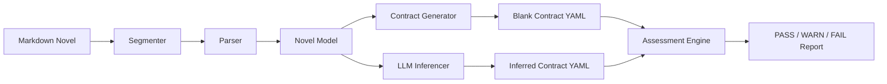
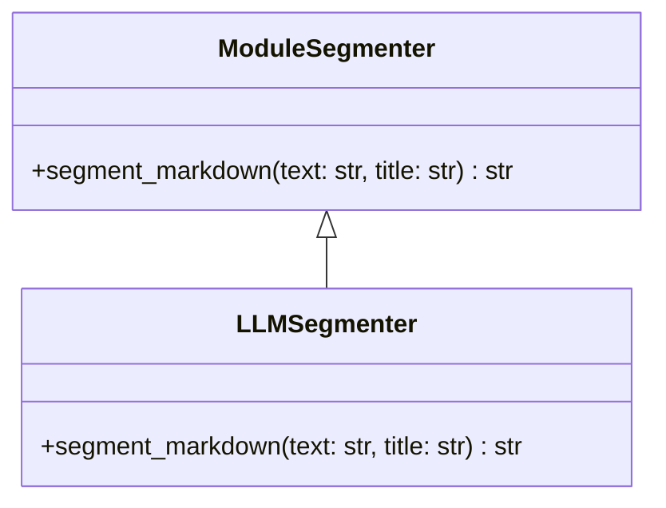
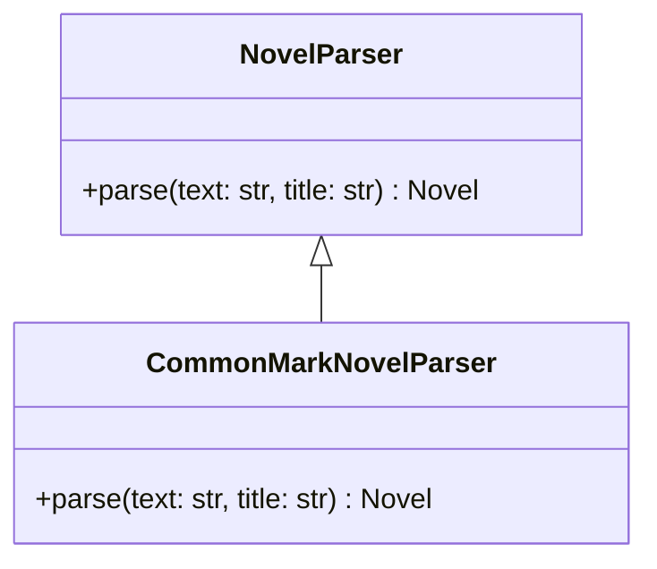
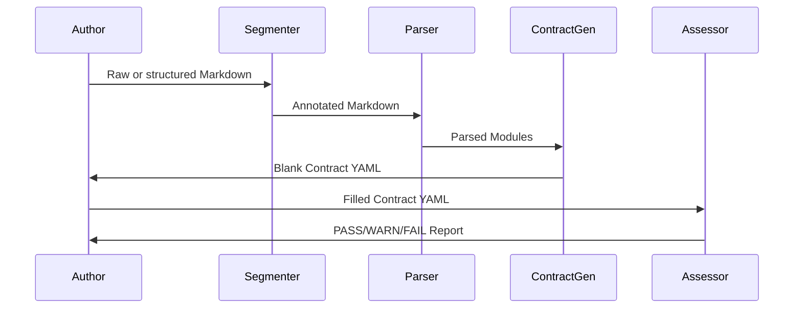
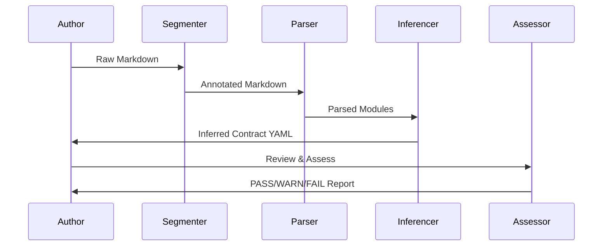

# Software Design

Novel Testbed is designed to treat a novel as a system that performs work. Each scene, exposition block, or transition is assumed to exist for one reason: to change the reader’s state in some measurable way. The architecture enforces this by separating structure, meaning, and evaluation into distinct, testable stages. Segmentation normalizes raw prose into explicit narrative joints. Parsing turns those joints into stable structural objects. Contracts make narrative intent explicit. Inference can automate that intent, but never replaces it. Assessment rules verify whether declared change actually occurred. An emergent property of this design is that a novel becomes observable as a dynamic system: pressure curves appear, dead zones become visible, repetition surfaces, and structural dishonesty is exposed. The system does not judge artistry. It makes narrative movement legible. The design supports this by ensuring every stage is deterministic, inspectable, and falsifiable, so that “this scene matters” becomes a claim that can be tested rather than a feeling that must be defended.

## Architecture

At a high level, the system is a pipeline with two entry paths and one mandatory normalization stage:



### Explanation

1. **Segmenter (New First Stage)**  
   The segmenter guarantees that raw prose is converted into *structurally valid Markdown*:

   - Adds chapter headers if missing
   - Adds module headers (`## Scene`, `## Exposition`, `## Transition`)
   - Ensures idempotence if Markdown is already structured
   - Produces canonical input for parsing

   The parser never receives unstructured prose.  
   That responsibility now belongs solely to segmentation.

2. **Parser**  
   Consumes only annotated Markdown and identifies:

   - Chapters
   - Modules
   - Module type
   - Text anchors
   - Stable module IDs

3. **Contract Generator**  
   Converts parsed modules into a YAML contract that declares:

   - Reader pre-state
   - Reader post-state
   - Intended narrative change

4. **LLM Inferencer**  
   Operates on parsed modules and fills the same contract automatically.

5. **Assessment Engine**  
   Applies rule objects to detect:

   - Missing change
   - Contradictory change
   - Inert modules
   - Structural dishonesty

This now mirrors:

```
normalize → parse → specify → validate → diagnose
```

Segmentation is normalization.

---

## Design Patterns (Add Segmentation)

### Strategy Pattern (Segmentation + Parsing)



This allows:

- deterministic segmentation
- optional LLM-based segmentation
- future alternatives without touching parsing or inference

And for parsing:



Segmentation and parsing are now explicitly separate responsibilities.

---

## Updated Conceptual Pipeline

Replace this:

```
Markdown → parse → infer
```

With this:

```
Markdown → segment → parse → infer
```

And for CLI:

| Command | Pipeline |
|------|--------|
| `segment` | Markdown → Segmented Markdown |
| `parse` | Markdown → Segment → Parse → Blank Contract |
| `infer` | Markdown → Segment → Parse → Infer → Contract (+ optional annotated Markdown) |
| `assess` | Contract → Rules → Report |

---

## Updated Narrative Contract Pipeline

### Author-declared workflow



### LLM-inferred workflow



---

## Design Correction Summary

What changed structurally:

| Before | Now |
|------|----|
Parser accepted raw prose | Parser only accepts structured Markdown |
Segmentation was implicit | Segmentation is explicit and testable |
Markdown validity was optional | Markdown validity is guaranteed |
Infer operated on raw input | Infer operates on normalized structure |
CLI was parse-first | CLI is segment-first |

This makes the system *deterministic*, *composable*, and *auditable*.

You now have a true compiler pipeline:

```
Source → Normalization → Syntax → Semantics → Verification
```
