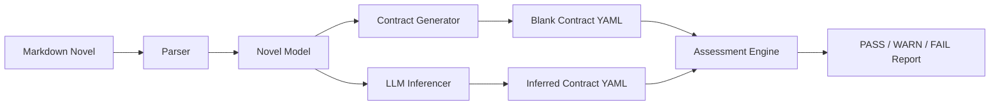
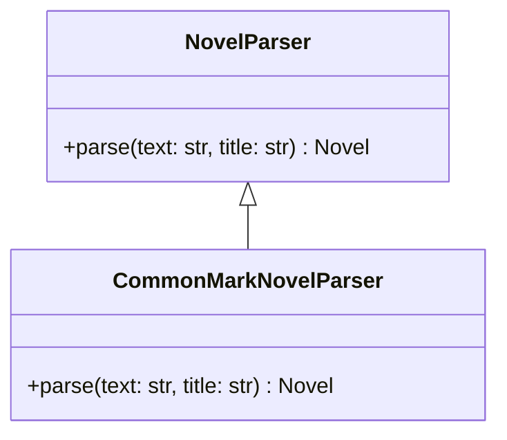
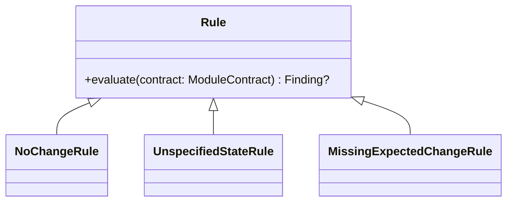
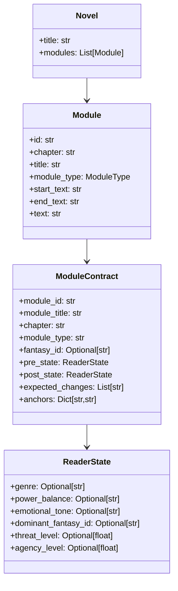
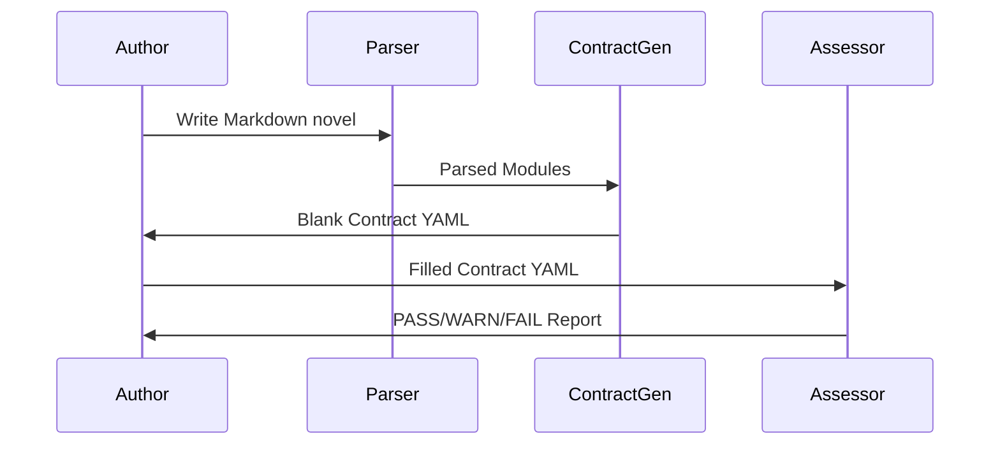
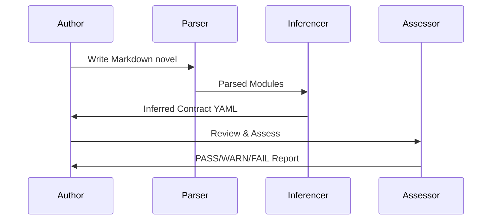

# Software Design

This system treats a novel as an executable structure.  
Each scene, exposition block, or transition module is a function that transforms reader state.  
If nothing changes, the module has failed.

The purpose of this design is not literary judgment but structural accountability.

A novel is not a mood object.  
It is a dynamic system.


## Goals

- Parse a Markdown novel into atomic fiction modules (scene, exposition, transition).
- Generate a contract YAML that declares narrative intent per module.
- Support both:
  - author-declared contracts
  - LLM-inferred contracts (Reader Response inference).
- Enforce explicit reader-state change through rule-based assessment.
- Identify passages that are well written but narratively inert.
- Provide a foundation for advanced narrative diagnostics:
  - power dynamics
  - genre drift
  - threat escalation
  - reader response activation.


## Architecture

At a high level, the system is a pipeline with two entry paths:



### Explanation

1. **Parser**  
   Reads CommonMark Markdown and identifies:
   - Chapters
   - Module boundaries
   - Module types (Scene, Exposition, Transition)
   - Text anchors (first and last non-empty lines)

2. **Contract Generator**  
   Converts parsed modules into a YAML specification that forces declaration of:
   - Reader pre-state
   - Reader post-state
   - Expected narrative change

3. **LLM Inferencer (optional front-end)**  
   Reads the same parsed novel and automatically:
   - infers reader state
   - infers expected change
   - populates a complete contract

4. **Assessment Engine**  
   Applies rule objects to determine:
   - whether declared change exists
   - whether state transitions are coherent
   - whether narrative pressure is actually applied

This mirrors real software pipelines:

```
parse → specify → validate → diagnose
```


## Design Patterns

### Strategy Pattern (Parser)

The parser is abstracted behind an interface so multiple input formats can coexist.



**Explanation**

This allows:
- Markdown today
- HTML tomorrow
- Scrivener or Word exports later

without touching the assessment logic.


### Rule Object Pattern (Assessment)

Each narrative constraint is a standalone rule.



**Explanation**

Rules are:
- independent
- composable
- explicit
- falsifiable

This prevents narrative evaluation from becoming a black box.


## Class Model

This diagram shows the structural heart of the system.




## Explanation of the Data Model

### Module

A `Module` is the atomic unit of narrative execution.  
It contains:

- structural position
- textual boundaries
- no interpretation

It is raw input.


### ReaderState (Reader Response)

`ReaderState` models reader perception:

| Field | Meaning |
|------|-------|
| genre | What story type the reader thinks this is |
| power_balance | Who controls outcomes |
| emotional_tone | Fear, control, unease, safety, hope |
| threat_level | How dangerous the world feels |
| agency_level | How capable the protagonist feels |

This is Reader Response expressed as data.


### ModuleContract

A `ModuleContract` is a narrative promise:

> “After this passage, the reader will not be the same.”

If the data says they are the same, the passage failed structurally.


## Narrative Contract Pipeline

### Author-declared workflow




### LLM-inferred workflow




## Extensibility

This system is intentionally incomplete.

Future expansions include:

- richer ReaderState fields:
  - captivity pressure
  - suspicion
  - trust erosion
  - moral collapse
- Reader Response classification:
  - desire
  - risk
  - inevitability
- Compression detection:
  - warn if consecutive modules produce identical state transitions
- Genre coherence rules:
  - survival → captivity → dominance
  - thriller → psychological entrapment → submission


## Philosophy

Most narrative critique is impressionistic.  
This system is adversarial.

It assumes:

- the novel is a machine
- scenes are functions
- meaning is output
- intention must be provable

It does not ask:

> “Is this beautiful?”

It asks:

> “Did this change anything?”

And if the answer is “no,”  
the module is dead code.