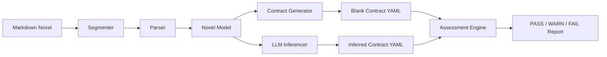
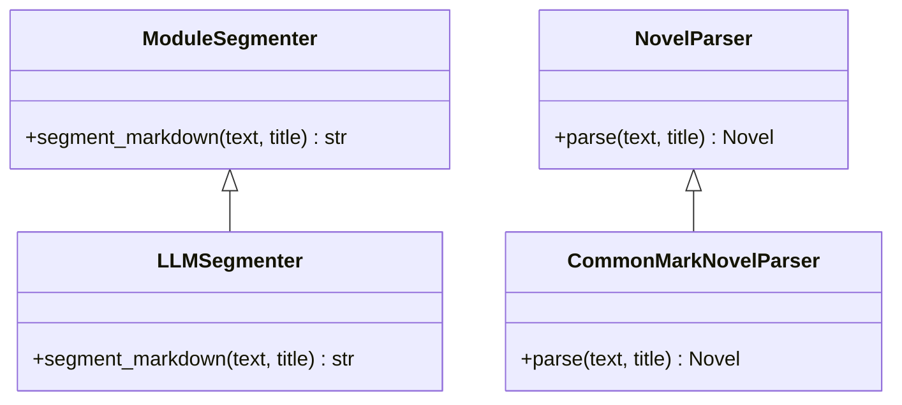
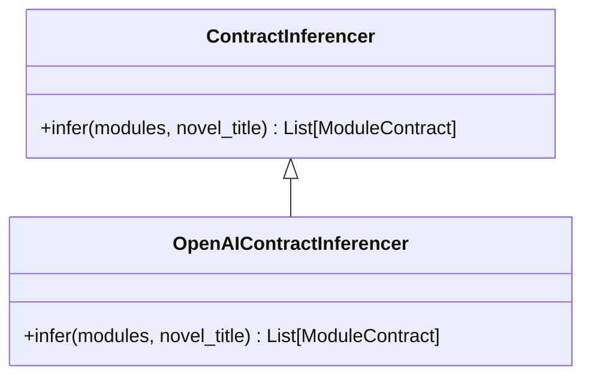
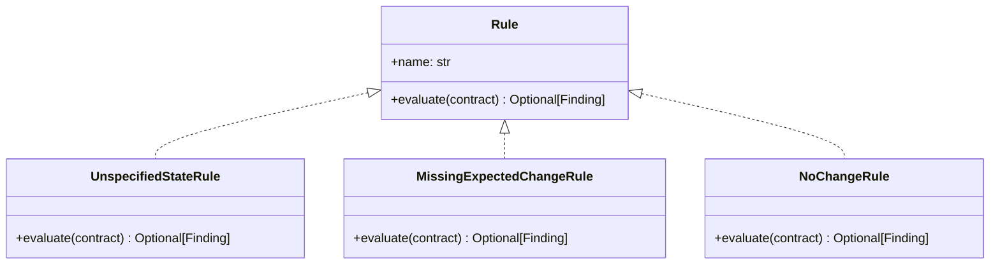
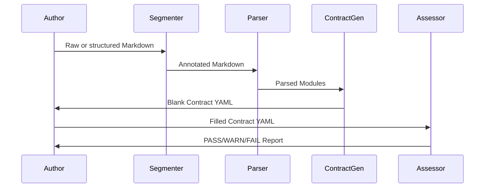
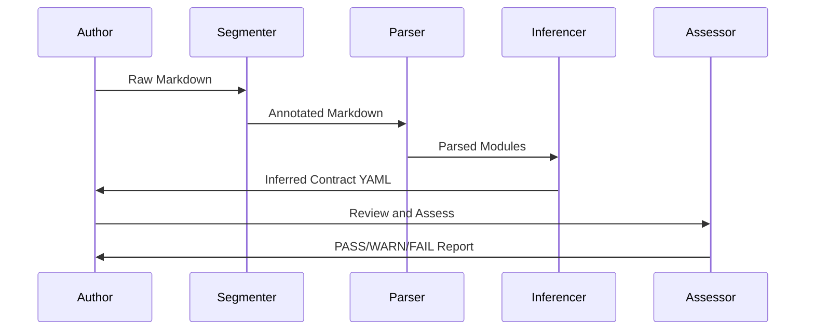

# Software Design

Novel Testbed is designed to treat a novel as a system that performs work.
Each scene, exposition block, or transition is assumed to exist for one reason:
to change the reader's state in some measurable way.

The architecture enforces this by separating structure, meaning, and evaluation
into distinct, testable stages. Segmentation normalizes raw prose into explicit
narrative joints. Parsing turns those joints into stable structural objects.
Contracts make narrative intent explicit. Inference can automate that intent,
but never replaces it. Assessment rules verify whether declared change actually
occurred.

An emergent property of this design is that a novel becomes observable as a
dynamic system: pressure curves appear, dead zones become visible, repetition
surfaces, and structural dishonesty is exposed. The system does not judge
artistry. It makes narrative movement legible.

Every stage is deterministic, inspectable, and falsifiable — so that
"this scene matters" becomes a claim that can be tested rather than a
feeling that must be defended.

---

## Architecture

At a high level, the system is a pipeline with two entry paths and one
mandatory normalization stage:


```mermaid
flowchart LR
    A[Markdown Novel] --> S[Segmenter]
    S --> B[Parser]
    B --> C[Novel Model]

    C --> D1[Contract Generator]
    D1 --> E1[Blank Contract YAML]
    E1 --> F[Assessment Engine]

    C --> D2[LLM Inferencer]
    D2 --> E2[Inferred Contract YAML]
    E2 --> F

    F --> G[PASS / WARN / FAIL Report]
```

### Pipeline stages

1. **Segmenter** — Guarantees structurally valid Markdown:
   - Adds chapter headers if missing
   - Adds module headers (`## Scene`, `## Exposition`, `## Transition`)
   - Ensures correct chapter → module ordering
   - Guarantees idempotency on already-structured input
   - Two implementations: `ModuleSegmenter` (deterministic) and
     `LLMSegmenter` (semantic, OpenAI-backed)

2. **Parser** — Consumes only annotated Markdown and identifies:
   - Chapters
   - Modules with their types
   - Text anchors (start / end previews)
   - Stable positional module IDs (`M001`, `M002`, ...)

3. **Contract Generator** — Converts parsed modules into a YAML contract:
   - Reader `pre_state`
   - Reader `post_state`
   - Intended narrative change (`expected_changes`)

4. **LLM Inferencer** — Operates on parsed modules and fills the same contract
   automatically, chaining `post_state` → `pre_state` across modules.

5. **Assessment Engine** — Applies rule objects to detect:
   - Missing change
   - Contradictory change
   - Inert modules
   - Structural dishonesty

This mirrors a standard compiler:

```
normalize → parse → specify → validate → diagnose
```

---

## Design Patterns

### Strategy Pattern (Segmentation + Parsing)

Both segmentation and parsing use the Strategy pattern to allow alternative
implementations without changing the pipeline.


```mermaid
classDiagram
    class ModuleSegmenter {
        +segment_markdown(text, title) str
    }
    class LLMSegmenter {
        +segment_markdown(text, title) str
    }
    ModuleSegmenter <|-- LLMSegmenter

    class NovelParser {
        +parse(text, title) Novel
    }
    class CommonMarkNovelParser {
        +parse(text, title) Novel
    }
    NovelParser <|-- CommonMarkNovelParser
```

### Template Method (Inference)

`ContractInferencer` defines the interface; `OpenAIContractInferencer`
provides the concrete implementation. New backends (Anthropic, NLP, local)
can be plugged in without touching the assessment layer.


```mermaid
classDiagram
    class ContractInferencer {
        +infer(modules, novel_title) List[ModuleContract]
    }
    class OpenAIContractInferencer {
        +infer(modules, novel_title) List[ModuleContract]
    }
    ContractInferencer <|-- OpenAIContractInferencer
```

### Protocol (Assessment Rules)

Assessment rules use a structural `Protocol` so any object implementing
`evaluate(contract) → Finding | None` qualifies as a rule — no inheritance
required.


```mermaid
classDiagram
    class Rule {
        +name: str
        +evaluate(contract) Optional[Finding]
    }
    class UnspecifiedStateRule {
        +evaluate(contract) Optional[Finding]
    }
    class MissingExpectedChangeRule {
        +evaluate(contract) Optional[Finding]
    }
    class NoChangeRule {
        +evaluate(contract) Optional[Finding]
    }
    Rule <|.. UnspecifiedStateRule
    Rule <|.. MissingExpectedChangeRule
    Rule <|.. NoChangeRule
```

### Dependency Injection (LLM clients)

Both `OpenAIContractInferencer` and `LLMSegmenter` accept their LLM client
via the constructor. This keeps them testable without network calls:

```python
# Production
client = OpenAILLMClient(config=LLMClientConfig(model="gpt-4.1-mini"))
inferencer = OpenAIContractInferencer(client=client)

# Tests
stub = StubClient(outputs=[...])
inferencer = OpenAIContractInferencer(client=stub)
```

### Layering

Layers are strictly ordered. Lower layers must not import from higher layers.

```
CLI (entry point)
  └── Segmentation   (no imports from inference, parser, contracts)
  └── Parser         (no imports from inference, contracts)
  └── Inference      (imports from parser models only)
  └── Contracts      (imports from models only)
  └── Models         (no imports from any application layer)
  └── Utils          (no imports from application layers)
```

`LLMSegmenter` uses a **local import** to obtain `OpenAILLMClient` at
instantiation time, avoiding a module-level dependency on the inference layer.

---

## Narrative Contract Pipeline

### Author-declared workflow


```mermaid
sequenceDiagram
    participant Author
    participant Segmenter
    participant Parser
    participant ContractGen
    participant Assessor

    Author->>Segmenter: Raw or structured Markdown
    Segmenter->>Parser: Annotated Markdown
    Parser->>ContractGen: Parsed Modules
    ContractGen->>Author: Blank Contract YAML
    Author->>Assessor: Filled Contract YAML
    Assessor->>Author: PASS/WARN/FAIL Report
```

### LLM-inferred workflow


```mermaid
sequenceDiagram
    participant Author
    participant Segmenter
    participant Parser
    participant Inferencer
    participant Assessor

    Author->>Segmenter: Raw Markdown
    Segmenter->>Parser: Annotated Markdown
    Parser->>Inferencer: Parsed Modules
    Inferencer->>Author: Inferred Contract YAML
    Author->>Assessor: Review and Assess
    Assessor->>Author: PASS/WARN/FAIL Report
```

---

## Source Provenance

The `parse` command embeds a `source` block in every contract YAML:

```yaml
source:
  original_path: /path/to/novel.md
  copied_path: /path/to/output/source.md
  sha256: a3f2c...
  generated_at: 2026-03-01T12:00:00+00:00
```

This SHA-256 fingerprint binds the contract to the exact version of the
source Markdown that generated it. Drift detection can be implemented by
comparing the stored hash against a re-hash of the current file.

---

## Test Coverage

| Area | Test files | Count |
|------|-----------|-------|
| Models | `tests/core/test_models.py` | 6 |
| CLI | `tests/core/test_cli.py` | 11 |
| Logging | `tests/core/test_logging_config.py` | 3 |
| Parser (unit) | `tests/parser/test_commonmark_parser.py` | 7 |
| Parser (integration) | `tests/parser/test_parser.py` | 1 |
| Parser (abstract) | `tests/parser/test_parser_base.py` | 3 |
| Segmentation (deterministic) | `tests/segmentation/test_segmentation_unit.py` | 5 |
| Segmentation (invariants) | `tests/segmentation/test_segmentation_invarients.py` | 4 |
| Segmentation (LLM stubbed) | `tests/segmentation/test_llm_segmenter.py` | 7 |
| Contracts | `tests/contracts/test_contract.py` | 4 |
| Contracts YAML | `tests/contracts/test_contract_yaml.py` | 1 |
| Rules | `tests/contracts/test_rules.py` | 7 |
| Assessor | `tests/contracts/test_assessor.py` | 5 |
| Inference (auto) | `tests/inference/test_auto_contract.py` | 3 |
| Inference (LLM client) | `tests/inference/test_llm_client_stubbed.py` | 3 |
| Inference (inferencer) | `tests/inference/test_llm_inferencer.py` | 1 |
| Prompts | `tests/inference/test_prompts.py` | 7 |
| Types | `tests/inference/test_types.py` | 10 |
| Fingerprinting | `tests/utils/test_source_fingerprint.py` | 8 |
| Integration | `tests/integration/test_pipeline.py` | 1 |
| **Total** | | **97** |

All 97 tests pass against the current codebase.
